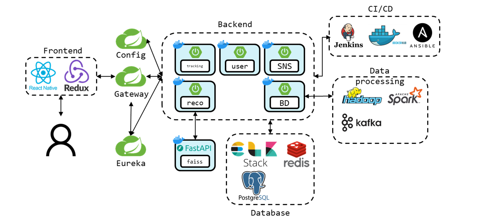

# 문득
> **산책 안에서 소소한 위로, 작은 행복, 긍정적 감정을 발견해 건강한 삶을 되찾자**

# 목차
1. [프로젝트 소개](#1-프로젝트-소개)
2. [서비스 소개](#2-서비스-소개)
3. [개발 환경](#3-개발-환경)
4. [기술 소개](#4-기술-소개)
5. [회고](#5-회고)

# 1. 프로젝트 소개
### 배경  
**"🌼산책 안에서 소소한 위로, 작은 행복, 긍정적 감정을 발견해 건강한 삶을 되찾자🌷"**  

- **바쁜 일상을 살아가는 현대인들은 하루의 대부분을 “앉아서” 생활함**  
  _ 2002년 세계보건기구는 의자병(sitting desease)라는 새로운 질병을 공식적으로 발표함
  _ 2021년 「질병관리청 국민건강통계」에 따르면 19세 이상 성인이 하루 평균 앉아서 보내는 시간은 8.9시간으로, 하루 24시간 중 3 분의 1 이상을 앉아서 지냄 \* 4명 중 1명(24.6%)은 앉아서 보내는 시간이 하루 12시간을 넘음  
- **스트레스에 항상 노출되어 있는 현대인들에게 이를 해소할 수 있는 건강한 방법에 대한 니즈 또한 점점 커지고 있음**  
  _ 고도로 복잡화된 사회에서 우리는 불특정 다수와 연결되어 있기 때문에 오롯이 나의 내면을 마주하는 시간은 줄어들 수밖에 없음
  _ 약해진 자아로 인해 편안한 심리 상태를 유지하는 것에 어려워하는 사람들이 늘어나고 있음
   
- **문득은 산책 문화를 일상화해서 현대인들의 몸과 마음의 스트레스를 해소하고 건강한 삶을 되찾기 위한 서비스임**  
  _ 매일매일 나의 산책 경로, 생각, 사진을 기록하고 같은 취미를 가지고 있는 사람들과 소통하며, 서로의 일상을 공유하는 긍정적인 커뮤니티를 형성할 수 있음
  _ 이를 통해 사용자들이 복잡한 현대 사회의 스트레스로부터 잠시 멀어지고, 몸과 마음이 건강한 커뮤니티를 형성하기를 기대함  

### 주요 기능  

`Tracking 정보` 경로 좌표, 거리, 소요 시간, 칼로리
`편의시설 정보` 반경 50m 내 음수대, 화장실, 안전지킴이 시설물
`실시간 현황 정보` 미세먼지 정보, 날씨 정보
 

> **1️⃣ Tracking**

1. 내 산책 경로 실시간 기록
   - 산책 경로 내 편의시설 정보를 집계하여 경로 정보와 함께 저장
   - 산책 후 제목, 내용, Tracking 정보, 편의시설 정보를 포함한 상세 정보 업로드
2. 산책 시작 시 내가 이동한 경로를 지도에 실시간으로 표시

> **2️⃣ Bigdata**

1. 185개 두드림길 추천
   - 사용자의 현재 위치 (구단위) 기준으로 가까운 두드림길을 정렬하여 추천
   - 두드림길 별 난이도/코스길이/소요시간, 음수대/화장실/안전지킴이 시설물 유무 정보를 제공
2. 185개 두드림길 실시간 현황 제공
   - 두드림길의 입구 기준 실시간 혼잡도, 미세먼지 농도, 온도를 API 사용하여 제공
3. 연관 검색어 크롤링 결과 제공
   - 해당 두드림길의 명칭 검색 뉴스 결과를 크롤링해 많이 도출된 단어를 워드 클라우드 형태로 요약하여 제공

> **3️⃣ Recommend**

1. 추천 순으로 정렬
   - 사용자의 위치(위·경도), 선호 거리, 선호 시간를 기반으로 FAISS 알고리즘을 적용하여 경로를 추천함
2. 찜 많은 순으로 정렬
   - 다른 사용자들이 찜을 많이 누른 순으로 정렬
3. 필터링 기능
   - 경로 내 음수대, 화장실, 안전지킴이 시설물 유무를 기준으로 더욱 상세한 필터링 가능
4. 사용자 정보 즉시 수정
   - 'Recommend' 탭에서 추천을 위한 사용자 정보를 즉시 수정 가능하도록 버튼을 구현

> **4️⃣ Feed**

1. 핀 만들기
   - 지도 상 현재 위치에 24시간 후 사라지는 숏폼 형식의 '핀' 기능으로 사진 공유 가능
   - 산책 경로 기록 중 '핀 만들기' 버튼으로 생성 가능하며, 기기의 사진을 선택하거나 새로 찍기 가능
2. 피드 만들기
   - 내가 저장한 산책로 정보와 연동하여 피드 생성 가능
   - 피드에는 사진을 여러 장 선택하여 업로드할 수 있으며, 제목과 해시태그 작성 가능
   - 피드에서
3. 이용자 검색 기능
   - 다른 사용자의 닉네임을 검색하여 팔로우/언팔로우 가능
4. 해시태그 검색 기능
   - 피드의 해시태그로 게시물 검색 가능

> **5️⃣ User**

1. 카카오 로그인 구현
   - 웹뷰 형식으로 카카오 페이지로 이동하여 카카오 계정으로 로그인이 가능하도록 구현
   - 기기 내 Async Storage에 user id를 저장하여 동일한 기기에서는 로그아웃 전까지는 재로그인이 필요하지 않도록 구현
1. 내 산책 / 찜한 산책 / 내 피드 확인
   - 내가 등록한 산책 경로, 찜한 산책 경로, 내가 올린 피드를 한 페이지에서 확인 가능

### 시스템 아키텍처

# 2. 서비스 소개
> **회원 로그인**

> **산책 시작**

> **산책 도중 24시간이 지나면 사라지는 핀 생성**

> **산책로 저장**

> **산책로 추천**

> **두드림길 (서울시 185개 공식 산책로)**

> **내 메인 피드화면**

> **유저 해시태그검색**

> **팔로잉 팔로우**

> **피드 생성**

<!--  -->
# 3. 개발 환경
### ⚙ Infra

<!--  -->
### 🎨 Front-End

### 🖥 Back-End
<!--  -->

### 💾 DB

### ⚒ Tools

# 4. 기술 소개
### 💽 Infra
-    Jenkins, Docker, Ansible를 이용하여 CI/CD를 구축
-    Namenode의 이중화를 지원하는 Hadoop을 클러스터 형태로 설치, 여기에 Spark 및 Spark Streaming 애플리케이션을 Yarn에 제출하는 방식을 사용하여 분산 병렬 데이터 처리에 대한 고가용성 보장
-    DB 사용에 대한 성능을 향상시키기 위해 Redis, PostgreSQL, Eleasticsearch, Kafka를 분산 클러스터 형태로 설치

### 🎨 Front-End  

### 🖥 Back-End
- `Cloud`
  - Gateway에서 모든 요청에 대해 사용자 인증을 하기 위해 Global Filter 구현
  -    Gateway: Spring Cloud Gateway를 통해 라우팅 및 로드밸런싱을 수행.  
    Request에서 유저 정보를 추출하여, 이를 Kafka를 통해 ELK에 전달하여 사용자 활동 모니터링을 수행
  -    Eureka: Spring Cloud Eureka를 통해 서비스 디스커버리, 서비스 헬스 체크 기능을 추가
  -    Config: Spring Cloud Config를 사용해서 분산화 되어 있는 Spring boot application의 설정 파일들을 중앙집중식으로 관리
- `User`
  - OAtuh2.0 카카오 로그인 서비스를 이용하여, 카카오에 저장된 회원 정보로 간편 로그인을 하여 본 서비스 이용
  - 카카오 회원 정보 기반으로 JWT 토큰 발급
  - DB에서 사용하기 위한 공통 코드 관리 API 구현
  - 특정 회원에 대한 팔로우, 팔로잉 기능 구현
- `SNS`
  - AWS S3 파일 업로드 기능 구현
  - 24시간이 지나면 사라지는 핀(사진) 기능 구현  
  => redis GeoHash를 이용하여 현재 위치에서 특정 반경내에 있는 핀 조회
  - 피드 생성 및 팔로잉 관계에 대한 피드 조회 기능
  - 해시태그 및 유저 검색
- `Tracking`
  -    Redis geospatial를 사용하여 편의시설 탐색 속도 향상
  -    JPA와 QueryDSL를 사용하여 산책로와 편의시설에 대한 CRUD 기능을 개발
- `Recommendation`
  -    사용자의 위치, 선호 산책 소요 시간, 선호 산책 거리를 기반으로 FAISS(Facebook AI Similarity Search)를 이용하여 사용자에게 산책로를 추천하는 기능 개발
  -    PostgreSQL과 ELK를 사용하여 고속 산책로 검색 기능을 개발
- `BigData`
  -    Spark를 사용하여 180여개의 두드림길(서울시 공식 산책로)에 대한 혼잡도, 온도, 미세먼지, 검색 결과 워드카운팅 수행
  -    Spark Streaming을 통해 10Km/h 이상의 이상 산책로 감지 수행
  -    PostGIS와 JPA를 사용하여 사용자 주변 두드림길의 분석 결과 반환 기능 개발

# 5. 회고
- **홍윤기**  
팀장으로써 프로젝트 회고와 리스크 관리에 가장 힘썼던 프로젝트였습니다. 수준 높은 기술들이 다양하게 도입되었고 모든 과정이 도전이었던 만큼 Jira, git을 활용하여 관리했던 이번 프로젝트의 성공이 스스로에게 크게 다가왔습니다.

- **김현종**  
사려깊은 팀원들 만나 이전에 적용해 보고 싶었고 러닝 커브가 있는 Spark Streaming 기반 이상 탐지, ELK 기반 모니터링 시스템, Jenkins기반 CI/CD, PostGIS 및 Redis geospatial 등을 적용하기 위해 집중할 수 있어서 좋았습니다. 특히, 이러한 기술에 대한 다양한 성능 테스트를 수행할 수 있어서 더더욱 좋은 프로젝트였습니다.

- **노성은**  
유능한 팀원들 덕분에 처음 접하는 react native의 러닝커브를 극복하고 프로젝트를 끝까지 잘 마무리할 수 있었습니다. 
개발 초기에 Expo를 사용하면서 React Native 앱을 빠르게 개발할 수 있어 편리하였으나, 앱의 규모가 증가할수록 의존성 충돌 등 Expo의 제약이 느껴지는 부분이 있었습니다. 
따라서 앱의 규모와 요구 사항에 맞게 Expo와 네이티브 코드를 조합하여 적절한 개발 방법을 선택하는 것이 중요하다고 느꼈습니다.

- **박기련**  
  열정적이고 유능한 팀원들을 만나 MSA 패턴을 경험하고, 특히 haddop, kafka 등 빅데이터 프레임워크와 Jenkins 등의 인프라를 배울 수 있었다는 점이 프로젝트에서 얻을 수 있었던 가장 큰 수확이었습니다.  

- **이수민**  

- **최민준**  
MSA에 대한 구조를 이해하며 설계를 해볼 수 있는 시간이었고, 직접 OAuth2.0 + JWT 인증방식을 통해 인증에 대해 이해할 수 있었습니다.   
또한 팀원들과 매일 스크럼을 통해 서로의 업무 진행도에 대해 원활하게 파악할 수 있었고 업무 외에도 다양한 얘기, 산책 등을 통하여 친해질 수 있는 계기가 마련되어 즐겁게 프로젝트를 진행할 수 있었습니다.

